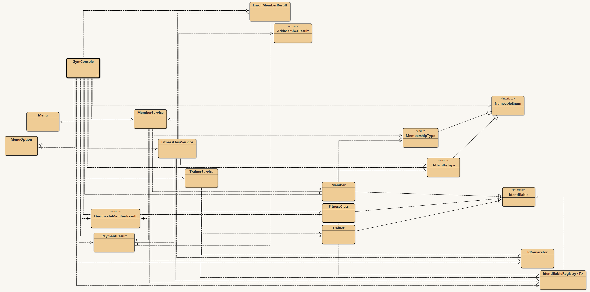

# Gym Refactoring Project (Java OOP)

## How to Run

To run the program, execute the `main` method located in the `GymConsole` class.

- Open the project in your preferred Java IDE
- Locate `GymConsole.java`
- Run the static `main` function inside `GymConsole`

This will start the console-based application and allow interaction through the command-line interface.

---

## Overview

This project is a refactored version of a gym management system built in Java for a final exam project. The primary goal was to improve structure, maintainability, and modularity while preserving the original user experience exactly.

If the original and refactored versions are run side by side, their outputs and behavior should be identical.

The project was developed using **BlueJ**, which provides a UML-based interface for navigating classes.

---

## UML Diagram

> If the image does not display, ensure the file name/path matches your repository structure (e.g. `uml.png` or `assets/uml.png`).

---

## Design Goals

- Preserve existing program behavior and user experience
- Refactor rather than rewrite (retain as much original logic as possible)
- Improve code organization and separation of concerns
- Reduce coupling and improve long-term maintainability

---

## Architecture

### Data Layer
- `Member`
- `FitnessClass`
- `Trainer`

### Service Layer (Business Logic)
- `MemberService`
- `FitnessClassService`
- `TrainerService`

### UI Layer
- `GymConsole`

---

## Key Design Decisions

### Enums for Status Handling
Used instead of magic numbers or exceptions for clearer control flow.

Example: `EnrollMemberResult`
- SUCCESS  
- CLASS_FULL  
- ALREADY_ENROLLED  
- INACTIVE_MEMBER  
- MEMBER_NOT_FOUND  
- CLASS_NOT_FOUND  

---

### Minimal Static Usage
Static methods are avoided where possible to reduce hidden dependencies and improve modularity.

---

### Interfaces and Polymorphism
- `Identifiable` interface allows multiple entity types to be managed generically.
- `IdentifiableRegistry` enables reusable storage logic across `Member`, `Trainer`, and `FitnessClass`.

---

## OOP Principles

### Encapsulation
Each class bundles related data and behavior together.

### Abstraction
Service classes hide business logic from the UI layer (`GymConsole`).

### Polymorphism
`IdentifiableRegistry` works across multiple object types through a shared interface.

### Inheritance (Interfaces)
Interfaces are used where appropriate; no class inheritance was used to avoid tight coupling.

---

## Disclaimer

This README was generated using ChatGPT based on a project report written by the author.
